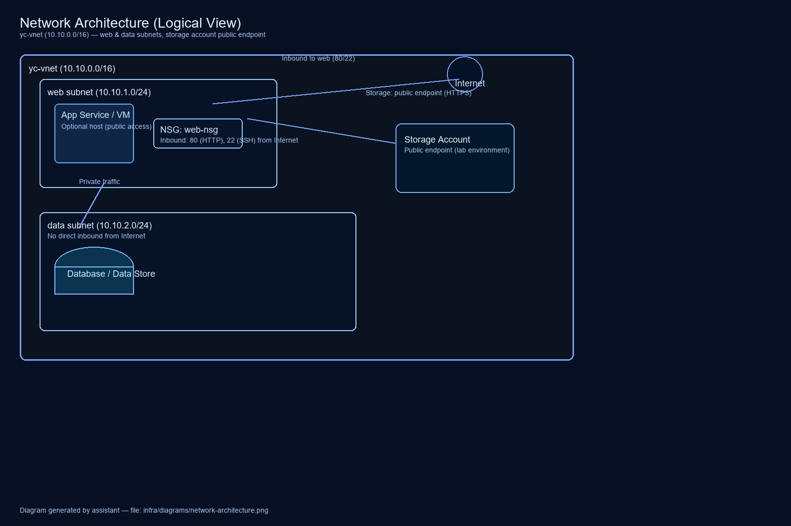

# Network Architecture (Text Description)

## Diagram files added

Also available as a PNG for easy embedding in slides or docs:

**Logical view:**

- `yc-vnet` (10.10.0.0/16)
  - `web` subnet (10.10.1.0/24)
    - Optional VM / App Service with NSG `web-nsg`
      - Inbound: 80/22 allowed from Internet
  - `data` subnet (10.10.2.0/24)
    - No direct inbound from Internet

Storage account is accessed over public endpoint (for this lab).
